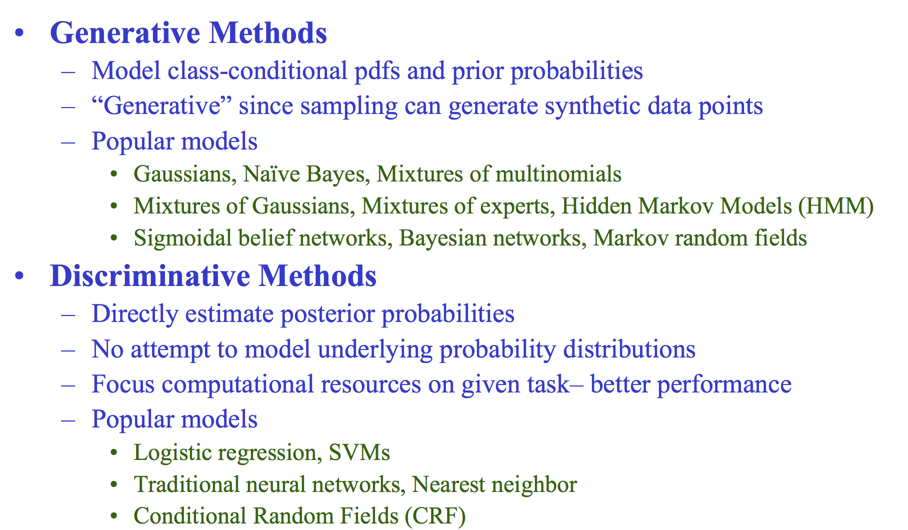

#############
ML questions
#############

#. How does a logistic regression model know what the coefficients are?
  Gradient Descent.  sigmod function.  y = wx + b.

#. Difference between convex and non-convex cost function; what does it mean when a cost function is non-convex?
  - A convex function: given any two points on the curve there will be no intersection with any other points, for non convex function there will be at least one intersection.
  - In terms of cost function with a convex type you are always guaranteed to have a global minimum, whilst for a non convex only local minima.

#. Is random weight assignment better than assigning same weights to the units in the hidden layer?
   - No.if all weights are the same, all units in hidden layer will be the same too. need to break symmetry
    --  E.g. if all weights are initialized to 1, each unit gets signal equal to sum of inputs (and outputs sigmoid(sum(inputs))). If all weights are zeros, which is even worse, every hidden unit will get zero signal
   - weights are initialized very close to zero, but randomly. This helps in breaking symmetry and every neuron is no longer performing the same computation.

#. trapping water(leetcode)

#. Gradient check
  numerically checking the derivatives computed by your code to make sure that your implementation is correct.

  `how gradient check <https://towardsdatascience.com/how-to-debug-a-neural-network-with-gradient-checking-41deec0357a9>`_

#. Describe Tree, SVM, Random forest and boosting. Talk about their advantage and disadvantages.
  `Pros and Cons <https://towardsdatascience.com/pros-and-cons-of-various-classification-ml-algorithms-3b5bfb3c87d6>`_

#. How do you weight 9 marbles three times on a balance scale to select the heaviest one?
  `visulization <https://mattgadient.com/9-marbles-and-a-weight-balance-which-is-the-heaviest-one/>`_

#. Describe the criterion for a particular model selection. Why is dimension reduction important?

#. What are the assumptions for logistic and linear regression?
  - Linear regression: Linearity of residuals, Independence of residuals, Normal distribution of residuals, Equal variance of residuals
  - Logistic regression: Dependent variable is binary, Observations are independent of each other, Little or no multicollinearity among the independent variables, Linearity of independent variables and log odds.

#. The probability that item an item at location A is 0.6 , and 0.8 at location B. What is the probability that item would be found on Amazon website?
  P(A or B) = P(A) + P(B) - P(A AND B) = 0.6 + 0.8 - (0.6*0.8) = 1.4 - 0.48 = 0.92

#. Given a ‘csv’ file with ID and Quantity columns, 50million records and size of data as 2 GBs, write a program in any language of your choice to aggregate the QUANTITY column.
  `example <https://www.kaggle.com/code/szelee/how-to-import-a-csv-file-of-55-million-rows/notebook>`_

#. When you have a time series data by monthly, it has large data records, how will you find out significant difference between this month and previous months values
  - t-test,z-test....
  TODO

#. What’s the difference between MLE and MAP inference?
  - MLE gives you the value which maximises the Likelihood P(D|θ). And MAP gives you the value which maximises the posterior probability P(θ|D). As both methods give you a single fixed value, they're considered as point estimators.

# [LeetCode]Given a function with inputs — an array with N randomly sorted numbers, and an int K, return output in an array with the K largest numbers.

#. When users are navigating through the Amazon website, they are performing several actions. What is the best way to model if their next action would be a purchase?
  - A sequential machine learning algorithm where you manage to keep the state of the user and predict his/her next action. Here many options are possible HMM, RNN, Bandits.

#. Estimate the disease probability in one city given the probability is very low national wide. Randomly asked 1000 person in this city, with all negative response(NO disease). What is the probability of disease in this city?
  - TODO

#. Describe SVM.

#. K-mean
  - `detail <https://zhuanlan.zhihu.com/p/78798251>`_

#. boosting
  - Boosting is an ensemble learning method that combines a set of weak learners into a strong learner to minimize training errors. In boosting, a random sample of data is selected, fitted with a model and then trained sequentially—that is, each model tries to compensate for the weaknesses of its predecessor

#. What are generative and discriminative algorithms? What are their strengths and weaknesses? Which type of algorithms are usually used and why?”
  - Discriminative models draw boundaries in the data space, while generative models try to model how data is placed throughout the space. A generative model focuses on explaining how the data was generated, while a discriminative model focuses on predicting the labels of the data.
  - `reference <https://cedar.buffalo.edu/~srihari/CSE574/Discriminative-Generative.pdf>`_

helpful links
==============
`reference_web_1 <https://gist.github.com/felipemoraes/c423d1447ee13585e2270b27f174fb13>`_
